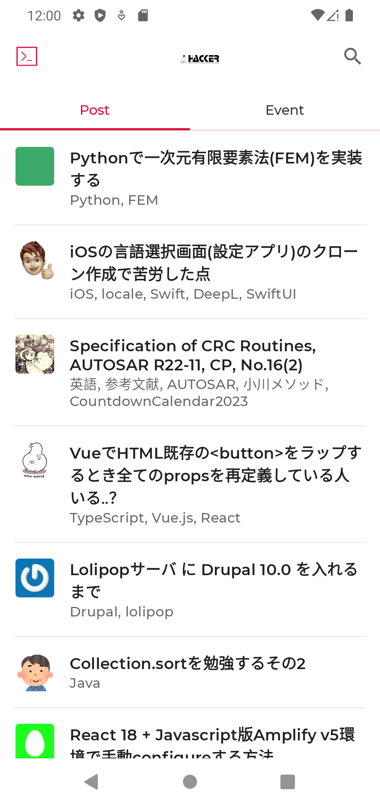
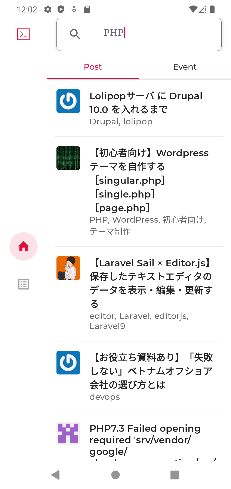
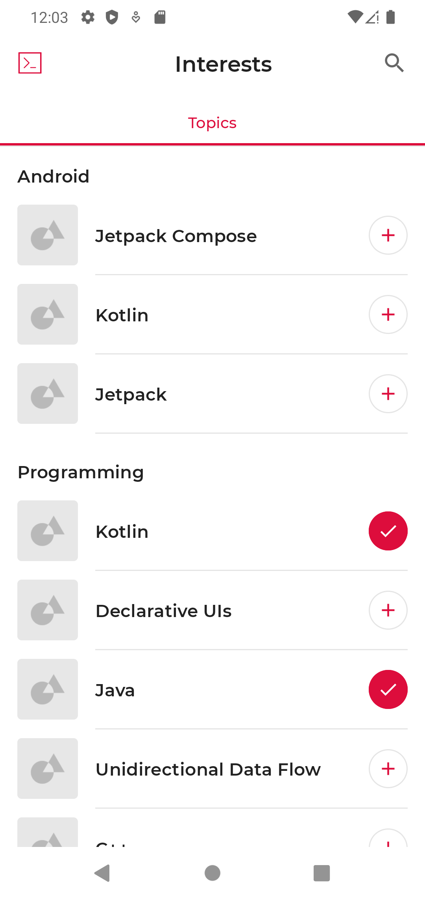

# Hacknews
Hacknews は、ハッカー向けのニュース リーディング アプリです。  
<br>

## 仕様概要
記事一覧、イベント一覧、インタレスティング画面の 3 つの画面が含まれています。
興味のあるトピックを購読します。 記事一覧から興味のある項目へのWebナビゲーション
イベント一覧からイベント情報の閲覧ができます。
インタレスティング画面では興味のあるキーワードを選択して、選択したキーワードの記事・イベント一覧を取得できます。
<br>  
<br>

### 使用ライブラリ
[Jetpack Compose](https://developer.android.com/jetpack/compose)   
[Jetpack Live Data](https://developer.android.com/topic/libraries/architecture/livedata?hl=ja)   
[Jetpack Flow](https://developer.android.com/kotlin/flow?hl=ja#jetpack)   
[Volley](https://developer.android.com/training/volley?hl=ja)   
[Gson](https://github.com/google/gson)   

<br>
<br>

### 動作手順
<br>

#### ①[Git](https://git-scm.com/)クローン
当プロジェクトをクローンします。
<br>

#### ②[Android Studio](https://developer.android.com/studio)  のインストール
Android studioインストール後に当プロジェクトをビルド・実行

<br>
<br>

### アプリの実装
パッケージ [`com.example.hacknews.ui`][1]

[`HacknewsApp.kt`][2] `NavDrawerLayout` でさまざまな画面を配置します。

[`HacknewsNavGraph.kt`][3] アプリ内のナビゲーション ルートとアクションを構成します。

[1]: app/src/main/java/com/example/hacknews/ui
[2]: app/src/main/java/com/example/hacknews/ui/HacknewsApp.kt
[3]: app/src/main/java/com/example/hacknews/ui/HacknewsNavGraph.kt
<br>
<br>

### 記事・イベント一覧画面
<br>

パッケージ [`com.example.hacknews.ui.home`][4]

これらの画面は、記事・イベント一覧情報を表示します。  
タブによって切り替わり縦にスクロールします。  

[4]: app/src/main/java/com/example/hacknews/ui/home  
<br>

|  記事一覧  |  イベント一覧  |
| :--: | :--: |
|  |  |

<br>
<br>
<br>
<br>

### 記事・イベント一覧画面（検索モード）

パッケージ [`com.example.hacknews.ui.home`][7]

テキストボックス内に入力されたキーワードを元に記事・イベント情報を出力します。

<br>

|  検索  |
| :-- |
|  |

<br>
<br>
<br>
<br>

### インタレスティング画面

パッケージ [`com.example.hacknews.ui.interests`][7]

この画面は、タブの使用方法と、選択したタブに応じてコンテンツを切り替える方法を示しています。 これ
カスタム チェックボックス ボタン [SelectTopicButton][8] も含まれます。
「Toggleable」構成可能関数を使用して提供する
カスタム UI を描画する際のオン/オフのアクション時プリファレンスに保持され、記事・イベント一覧画面遷移、次回起動時にキーワードの情報が反映されます。

[7]: app/src/main/java/com/example/hacknews/ui/interests
[8]: app/src/main/java/com/example/hacknews/ui/interests/SelectTopicButton.kt
<br>

|  インタレスティング  |
| :-- |
|  |

<br>
<br>
<br>
<br>

### データ
記事情報：ITエンジニア向けコミュニティサービス[Qiita](https://qiita.com/)  
イベント情報：ITエンジニア向けイベントサイト[CONNPASS](https://connpass.com/)  
<br>
<br>

### インストルメント化された Robolectric テスト

UI テストは、デバイス/エミュレーター、または Robolectric を使用した JVM で実行できます。

* 計装テストを実行するには、「計装テスト」実行構成を使用するか、`./gradlew connectedCheck` コマンドを実行します。
* Robolectric でテストを実行するには、「Robolectric テスト」実行構成を使用するか、`./gradlew testDebug` コマンドを実行します。  

<br>
<br>
<br>
<br>


## ライセンス

```
Copyright 2022 WakuWaku プロジェクト

Apache ライセンス、バージョン 2.0 (「ライセンス」) の下でライセンス供与されています。
ライセンスに準拠しない限り、このファイルを使用することはできません。
ライセンスのコピーは、次の URL で入手できます。

     https://www.apache.org/licenses/LICENSE-2.0

適用法で義務付けられている場合、または書面で同意されている場合を除き、ソフトウェア
ライセンスに基づいて配布されるものは、「現状のまま」で配布されます。
明示または黙示を問わず、いかなる種類の保証または条件もありません。
権限を管理する特定の言語については、ライセンスを参照してください。
ライセンスに基づく制限。
```
